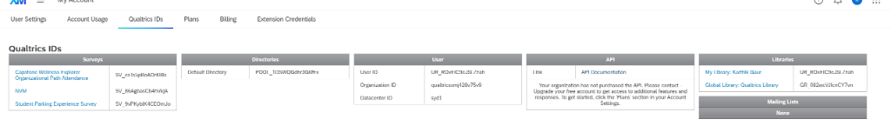
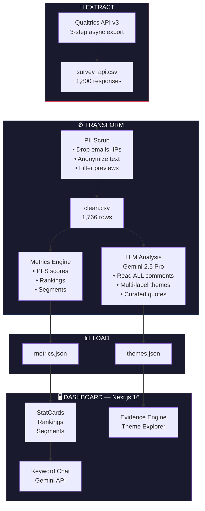

# 🅿️ UA Parking Intelligence Platform

> **Full-stack analytics + ETL platform** that extracts live survey data from Qualtrics, transforms it through an automated data pipeline (PII scrubbing, metrics computation, LLM thematic analysis), and loads it into an interactive dashboard with AI-powered insights.

[](https://nextjs.org/)
[](https://python.org)
[](https://ai.google.dev/)
[](LICENSE)

---

## ✨ Key Features

### 📊 Executive Dashboard
Real-time visualization of survey insights with **consulting-grade metrics**:
- **Skip Rate**: 76.9% of students have skipped class due to parking (1351/1757)
- **Difficulty Rate**: 75.7% report parking as difficult (1335/1763)
- **Top Challenge**: Too few spots (weighted score: 3798)
- **1,766 responses** from Qualtrics API live fetch



### 🧠 LLM-Powered Thematic Analysis
Gemini 2.5 Pro performs full qualitative thematic analysis on all 1,442 free-text responses in a single pass — the same way a research consultant would, but in 48 seconds.

| Theme | Count | % |
|-------|-------|---|
| Increase Parking Supply | 685 | 47.5% |
| Closer Parking Lots | 621 | 43.1% |
| Reduce Permit Costs | 374 | 25.9% |
| Revise Parking System & Zones | 338 | 23.4% |
| Reform Ticketing & Enforcement | 215 | 14.9% |
| Improve Bus System | 92 | 6.4% |

> Percentages exceed 100% because comments can relate to multiple themes (multi-label analysis).

**Technical Implementation:**
- **Gemini 2.5 Pro** — all comments sent in a single ~45K token prompt for qualitative analysis
- **Multi-label tagging** — each comment tagged with primary theme via Gemini 2.5 Flash for segment breakdowns
- **Verbatim quote curation** — LLM selects 5 most representative direct quotes per theme

### 💬 Keyword-Based Survey Chat
- Chat interface powered by keyword matching on theme quotes
- Gemini-generated responses grounded in actual student responses
- Not true RAG — uses keyword relevance scoring, not vector retrieval

---

## 🏗️ Architecture



---

## 🛠️ Tech Stack

| Layer | Technology | Purpose |
|-------|------------|---------|
| **Frontend** | Next.js 16 + React 19 | App Router, Server Components |
| **Styling** | Tailwind CSS | Dark theme, glassmorphism effects |
| **Charts** | Recharts | Interactive data visualization |
| **ETL Pipeline** | Python 3.10+ | Extract (Qualtrics API), Transform, Load |
| **Data Source** | Qualtrics API v3 | 3-step async export (create → poll → download) |
| **AI/LLM** | Gemini 2.5 Pro + Flash | Thematic analysis + multi-label tagging |
| **Database** | File-based JSON | Version-controlled artifacts |

---

## 🚀 Quick Start

### Prerequisites
- Node.js 18+
- Python 3.10+
- [Gemini API key](https://aistudio.google.com/apikey) (free tier works)

### Installation

```bash
# Clone and install
git clone https://github.com/Karthikgaur8/ua-parking-platform.git
cd ua-parking-platform
npm install
pip install -r requirements.txt

# Configure environment
cp .env.example .env.local
# Add your GEMINI_API_KEY to .env.local

# Start development server
npm run dev
```

### Run the Pipeline

```bash
# 🔄 Full refresh via Qualtrics API (recommended):
python scripts/refresh_data.py --fetch

# This runs all steps automatically:
#   0. Fetches latest responses from Qualtrics API  → data/raw/survey_api.csv
#   1. Cleans data (PII removal, anonymization)     → data/clean.csv
#   2. Builds metrics & rollups                     → artifacts/metrics.json
#   3. LLM thematic analysis (Gemini 2.5 Pro)       → artifacts/themes.json

# Quick refresh (API fetch + skip AI theme re-clustering):
python scripts/refresh_data.py --fetch --skip-themes

# Manual refresh (from local XLSX export):
python scripts/refresh_data.py --input data/raw/survey.xlsx

# Fetch-only (just download, don't process):
python scripts/fetch_qualtrics_api.py
```

---

## 📁 Project Structure

```
ua-parking-platform/
├── src/
│   ├── app/
│   │   ├── page.tsx              # Executive dashboard
│   │   ├── chat/page.tsx         # Keyword chat interface
│   │   ├── evidence/page.tsx     # Evidence Engine (theme explorer)
│   │   └── api/
│   │       ├── chat/route.ts     # Chat API (Gemini)
│   │       └── evidence/route.ts # Evidence API (cache-invalidated)
│   ├── components/
│   │   ├── StatCard.tsx          # Animated metric cards
│   │   ├── RankingsChart.tsx     # Weighted priority visualization
│   │   ├── SegmentChart.tsx      # Cross-tab breakdown
│   │   ├── DistributionPie.tsx   # Category distributions
│   │   ├── ChatInterface.tsx     # AI chat component
│   │   └── ThemeExplorer.tsx     # Interactive theme browser
│   └── lib/
│       └── data.ts               # Data loading utilities
├── scripts/
│   ├── refresh_data.py           # ⭐ One-command pipeline orchestrator
│   ├── fetch_qualtrics_api.py    # Qualtrics API 3-step async export
│   ├── load_qualtrics.py         # PII removal + anonymization (CSV/XLSX)
│   ├── build_rollups.py          # Metrics with n/N format
│   ├── build_themes_llm.py       # ⭐ LLM thematic analysis (Gemini 2.5 Pro)
│   └── build_themes.py           # Legacy: K-Means clustering (deprecated)
├── artifacts/
│   ├── metrics.json              # Precomputed dashboard data
│   └── themes.json               # LLM-generated theme analysis
├── data/
│   ├── clean.csv                 # Anonymized survey responses
│   └── raw/                      # Original files (gitignored)
└── .env.example                  # Environment template
```

---

## 🔒 Privacy & Governance

This platform implements **privacy-by-design**:

- ✅ **PII Removal**: Emails, IPs, geolocation scrubbed before processing
- ✅ **Anonymized Quotes**: No identifying information in displayed text
- ✅ **Citation-Backed AI**: All insights link to source quotes
- ✅ **Audit Trail**: Version-controlled JSON artifacts

---

## 📐 Key Metrics Formulas

### Parking Friction Score (PFS)
Weighted composite score (0-1 scale):
```python
PFS = 0.35 * difficulty_score + 0.35 * minutes_norm + 0.30 * skip_score
```

### Weighted Priority Score
For ranking challenges:
```python
Score = 3 × rank1_count + 2 × rank2_count + 1 × rank3_count
```

---

## 🧪 Testing

```bash
# Type checking
npx tsc --noEmit

# Build verification
npm run build

# Development server
npm run dev
```

---

## 📈 Roadmap

- [x] Phase 0: ETL pipeline + PII scrubbing
- [x] Phase 1: Interactive executive dashboard
- [x] Phase 2: AI theme analysis + Evidence Engine
- [x] Phase 3: Keyword-based survey chat
- [x] Phase 3.5: Qualtrics API live fetch (automated ETL)
- [ ] Phase 4: True RAG (vector embeddings for semantic retrieval)
- [ ] Phase 5: PDF brief generator (automated stakeholder reports)

---

## 👤 Author

**Karthik Gaur**
- Building data-driven tools for university stakeholders
- Focus: Full-stack development, ML/NLP, product analytics

---

## 📄 License

MIT License - See [LICENSE](LICENSE) for details.
